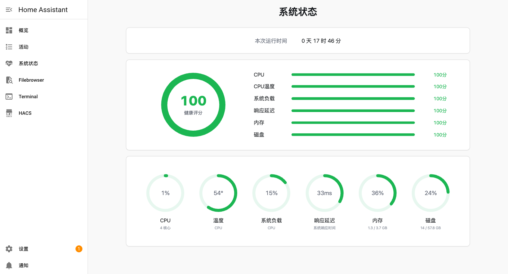
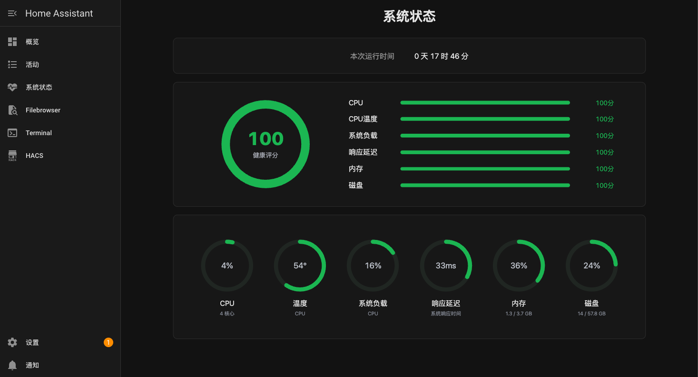

# Home Assistant 系统状态监控

一个简洁的 Home Assistant 加载项，用来在侧边栏查看系统运行状态和健康评分。

## 赞助支持

如果您觉得我做的系统状态工具对您有帮助，欢迎请我喝杯奶茶，您的支持将是我持续改进的动力！

<div align="center">
  
  
</div>

## 功能

<div align="center">
  
  <br><br>
  
</div>

- 显示本次运行时间
- 显示综合健康评分
- 显示 CPU、温度、系统负载、响应延迟、内存、磁盘
- 支持 Home Assistant Ingress，打开侧边栏即可使用
- 默认 30 秒刷新一次

## 数据说明

- 内存：优先读取 `/proc/meminfo`，按 `MemTotal - MemAvailable` 计算真实已用内存
- 磁盘：优先通过 Supervisor `/host/info` 读取宿主机磁盘容量
- 温度：优先读取 CPU 温度传感器，读取不到时显示 `N/A`
- 响应延迟：通过 Home Assistant Core API 探测平均响应时间

## 健康评分

健康评分从 100 分开始扣分，顺序为：

`CPU / CPU温度 / 系统负载 / 响应延迟 / 内存 / 磁盘`

| 项目 | 扣分规则 |
|------|----------|
| CPU | > 90% 扣 25，> 75% 扣 15，> 50% 扣 5 |
| 内存 | > 90% 扣 25，> 75% 扣 15，> 50% 扣 5 |
| 磁盘 | > 90% 扣 25，> 75% 扣 15，> 50% 扣 5 |
| 系统负载 | > 2 倍 CPU 核心数扣 15，> 1 倍 CPU 核心数扣 10 |
| CPU温度 | > 80°C 扣 15，> 70°C 扣 8 |
| 响应延迟 | > 500ms 扣 25，> 200ms 扣 15，> 100ms 扣 5 |

## 安装

1. 打开 Home Assistant
2. 进入 **设置 → 加载项 → 加载项商店**
3. 右上角选择 **仓库**
4. 添加本仓库地址
5. 安装 **系统状态监控**
6. 启动加载项，并打开侧边栏显示

## 配置

默认配置：

```yaml
refresh_interval: 30
port: 8099
```

- `refresh_interval`：刷新间隔，范围 5 到 300 秒
- `port`：服务端口，默认 8099
